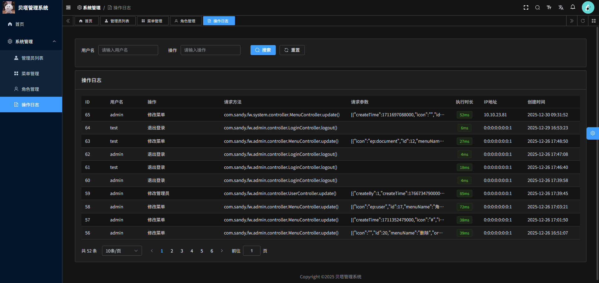

# Sandy Framework

本项目是基于ruoyi-vue-pro前端改造了一个基于 Spring Boot + Spring Security + MyBatis Plus + Vue3 的轻量级前后端分离权限管理基础框架，开箱即用。

## 截图



## ✨ 功能特性

- 🔐 用户认证：登录 + 滑块验证码
- 📋 菜单管理：支持多级菜单配置
- 👥 角色管理：灵活的角色权限分配
- 👤 用户管理：用户增删改查
- 🔑 权限控制：菜单权限 + 按钮级权限
- 📝 操作日志：记录用户操作行为
- 📖 接口文档：Knife4j 在线 API 文档
- 💳 支付模块：支付功能扩展支持
- 🔄 多数据源：动态数据源切换

## 🏗️ 项目结构

```
sandy-framework
├── doc/                    # 数据库脚本
├── front/sandy-admin/      # 前端项目 (Vue3 + Element Plus)
├── sandy-boot/             # 启动模块 - 聚合所有业务模块的统一入口
├── sandy-common/           # 公共模块 - 工具类、通用配置
├── sandy-security/         # 安全模块 - Spring Security 认证授权
├── sandy-system/           # 系统模块 - 系统管理业务
└── sandy-pay/              # 支付模块 - 支付相关功能
```

## 🛠️ 技术栈

### 后端

| 技术 | 版本 | 说明 |
|------|------|------|
| JDK | 1.8 | 开发环境 |
| Spring Boot | 2.6.7 | MVC 核心框架 |
| Spring Security | - | 安全认证框架 |
| MyBatis Plus | 3.5.5 | ORM 框架 |
| Knife4j | 3.0.3 | 在线接口文档 |
| Redis | - | 缓存 |
| HikariCP | - | 数据库连接池 |
| JWT | 0.9.1 | Token 管理 |
| Hutool | 5.8.24 | Java 工具集 |
| Fastjson | 1.2.83 | JSON 处理 |
| Captcha | 1.3.0 | 滑块验证码 |
| Dynamic Datasource | 3.6.1 | 多数据源切换 |

### 前端

| 技术 | 版本 | 说明 |
|------|------|------|
| Vue | 3.5.12 | 前端框架 |
| Vite | 5.1.4 | 构建工具 |
| Element Plus | 2.11.1 | UI 组件库 |
| TypeScript | 5.3.3 | 类型支持 |
| Pinia | 2.1.7 | 状态管理 |
| Vue Router | 4.4.5 | 路由管理 |
| Axios | 1.9.0 | HTTP 请求 |
| UnoCSS | 0.58.5 | 原子化 CSS |
| ECharts | 5.5.0 | 图表库 |

## 📋 环境要求

| 工具 | 版本 |
|------|------|
| JDK | 1.8+ |
| MySQL | 5.7+ |
| Redis | 3.2+ |
| Node.js | 16.0+ |
| pnpm | 8.6.0+ |

## 🚀 快速开始

### 后端启动

1. 克隆项目并使用 IDEA 导入（需安装 Lombok 插件）

2. 导入数据库脚本
   ```sql
   -- 将 doc/framework.sql 导入到 MySQL
   ```

3. 修改配置文件 `sandy-boot/src/main/resources/application-dev.yml`
   ```yaml
   spring:
     datasource:
       url: jdbc:mysql://localhost:3306/your_database
       username: your_username
       password: your_password
     redis:
       host: localhost
       port: 6379
   ```

4. 启动项目
   ```bash
   # 通过 sandy-boot 模块的 SandyBootApplication 启动
   mvn spring-boot:run -pl sandy-boot
   ```

### 前端启动

```bash
# 进入前端目录
cd front/sandy-admin

# 安装依赖
pnpm install

# 启动开发服务器
pnpm dev

# 构建生产版本
pnpm build:prod
```

## 🔑 默认账号

| 账号 | 密码 | 说明 |
|------|------|------|
| admin | 123456 | 超级管理员 |

## 📖 接口文档

启动后端服务后访问：`http://localhost:端口/doc.html`

## 📄 License

MIT License
